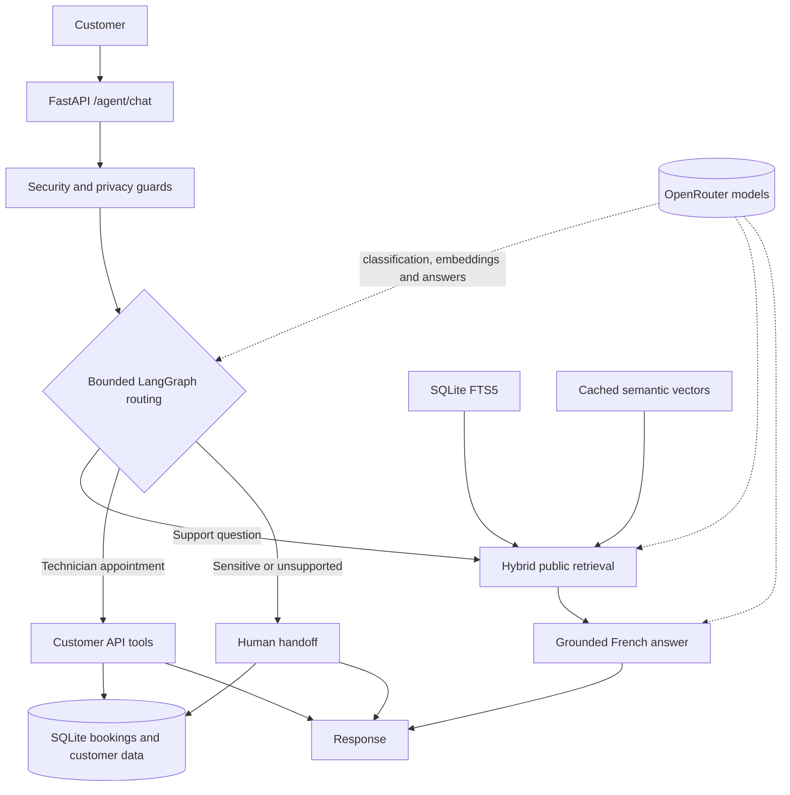

# Néova Télécom — French Customer Agent

A local French customer-service agent built with FastAPI, LangGraph and SQLite. It answers questions from the supplied support corpus, reads scoped customer information, books technician appointments and hands sensitive or unsupported requests to a human path.

This is a take-home demo using fixture customers. Demo sessions are not production authentication, and handoff records are not connected to a real advisor queue.

## Quick start

Requirements:

- Python 3.12+
- [uv](https://docs.astral.sh/uv/)
- The supplied repository files

Create the local configuration:

```bash
cp .env.example .env
```

PowerShell equivalent:

```powershell
Copy-Item .env.example .env
```

The application can start without model credentials. From the repository root, run:

```bash
uv run --locked --env-file .env -- python main.py
```

Then open:

- Health check: `http://127.0.0.1:8000/health`
- Swagger API: `http://127.0.0.1:8000/docs`

Startup seeds SQLite from the unchanged fixture and builds an FTS5 index over the public corpus. It does not make paid embedding calls.

For detailed API and conversation examples, see the [curl walkthrough](docs/manual-e2e-curl.md).

### Demo appointments

The supplied appointment slots are dated August–September 2026. They are rejected when they are in the past.

To reproduce the fixture scenario, configure:

```dotenv
CLOCK_MODE=frozen
DEMO_TIMESTAMP=2026-08-26T12:00:00+02:00
```

Restart the server after changing these values.

Create a session using `POST /demo/sessions`, then send its token through the `X-Demo-Session` header. A booking is saved only after the user replies with the exact one-time phrase:

```text
CONFIRMER RDV <code>
```

A bare `oui` does not create an appointment.

## Retrieval modes

| Situation | Retrieval behavior |
| --- | --- |
| Clean keyless startup | Public FTS5 keyword search |
| Vector index available | Hybrid semantic + FTS5 search |
| Embedding request fails | Visible FTS5 fallback |
| Internal documents | Never indexed or returned |

Hybrid retrieval combines cosine similarity over cached embeddings with SQLite FTS5 rankings using reciprocal-rank fusion.

To build the optional semantic vector index:

```bash
uv run --locked --env-file .env -- python -m neova.retrieval index
```

This requires `OPENROUTER_API_KEY` and `EMBEDDING_MODEL`. It is protected by a remaining-budget check and may consume OpenRouter credit.

## Architecture



Each turn follows a finite graph with a hard step bound. There is no autonomous tool loop.

The graph performs deterministic injection checks before model calls, classifies the request, reads only the required customer data, retrieves public evidence and then answers, books or offers a handoff. Appointment writes are atomic and idempotent.

## Model configuration

Model names are configured through environment variables so reviewers can replace them:

```dotenv
CLASSIFIER_MODEL=
CHAT_MODEL=
CHAT_FALLBACK_MODEL=
EMBEDDING_MODEL=
```

Observed live status:

- `mistralai/mistral-small-3.2-24b-instruct` produced a successful French answer.
- `openai/gpt-4.1-nano` returned 404 under strict structured-output routing and degraded to the keyword classifier.
- `qwen/qwen3-embedding-8b` was configured but not verified on a populated live vector index.
- No distinct fallback route was configured or verified.

These observations are not presented as a fully verified live model stack. Without working model configuration, the API, FTS5 retrieval and deterministic booking paths remain available, while model-dependent answers degrade visibly.

Optional Langfuse tracing is disabled unless its environment keys are configured. See the [tracing evidence](docs/langfuse-tracing-evidence.md).

## Evaluation and tests

Run the fixed offline evaluation:

```bash
uv run --locked --extra dev python -m neova.eval
```

Run the full test suite:

```bash
uv run --locked --extra dev python -m pytest tests -q
```

Measured offline result: **12/12 cases passed, 0 failed**.

| Category | Result |
| --- | ---: |
| Routing | 1/1 |
| Grounding | 3/3 |
| Booking | 2/2 |
| Handoff | 2/2 |
| Resilience | 3/3 |
| Privacy | 1/1 |

The evaluation uses a frozen clock, fake chat and embedding models, keyword classification and injected API 500/OpenRouter 429/529 failures. It measures routing, state changes, retrieval behavior and safe failure shapes—not live French answer quality. The complete suite recorded **200 passing tests** with one upstream Starlette deprecation warning.

Cases, checks and actual outputs are available in [`eval/`](eval/) and the [evaluation report](docs/issue-7-evaluation-security-report.md).

### Spend

The offline evaluation made no paid calls.

Earlier partial tracing recorded **$0.000159 of known chat cost**, plus four classifier calls whose cost was unavailable. Embedding cost was not present in that ledger. A historical key query showed **$14.982852627 used from a $15 cap**, including assistant and application usage that cannot be separated. These values overlap and must not be added; total project spend by component remains unknown.

## Three design decisions

| Decision | Benefit | Trade-off |
| --- | --- | --- |
| Bounded graph and exact confirmation code | Inspectable flow and controlled state changes | Less flexible than a free-form autonomous agent |
| FTS5 startup with optional cached embeddings | Search works immediately without spending credit | Semantic French paraphrases require explicit vector indexing |
| SQLite API with minimal handoff records | Atomic bookings and reproducible local execution | Demo sessions are not authentication and no real advisor queue exists |

## Known limitations

- The classifier, fallback route and embedding model are not fully verified live.
- There is no live-model evaluation score.
- Fixture appointments are in the past under later live dates.
- Cancellation, payment, real contract termination and advisor dispatch are unsupported.
- Demo sessions only separate fixture customers; they do not prove identity.
- Langfuse and usage logs must never be treated as storage for private customer data.

With two more days, I would:

1. Verify a French classifier and a fallback served by a different upstream provider.
2. Build the live vector index and run a small budget-gated French evaluation with failure analysis.
3. Replace demo identity and local handoffs with real authentication and advisor-queue integrations.

See the [final delivery evidence](docs/issue-8-final-delivery-evidence.md) for the clean-start smoke test, integrity checks and detailed limitations.