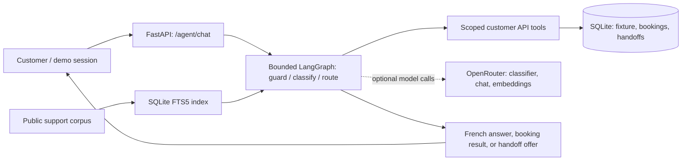

# Néova Télécom — French customer agent

One-process FastAPI customer service and bounded LangGraph conversation agent over the supplied fixture and public support corpus. Local demo only; no real customer authentication or advisor queue.

## Start and try it

Prerequisites: Python 3.12+, [uv](https://docs.astral.sh/uv/), and the supplied repository assets. Copy `.env.example` to `.env` (`cp .env.example .env` on Unix; `Copy-Item .env.example .env` in PowerShell). Set `OPENROUTER_API_KEY`, `CHAT_MODEL`, `CLASSIFIER_MODEL`, and `EMBEDDING_MODEL` only if using live model calls. The key must have remaining budget; never commit `.env`. From the repository root, run **one server command**:

```bash
uv run --locked --env-file .env -- python main.py
```

Visit `http://127.0.0.1:8000/health` (200, `db_ready: true`) or `/docs`. Startup seeds a local SQLite database from the unchanged supplied JSON and indexes the **public corpus for FTS5**; it makes no paid embedding calls. To use semantic/hybrid vectors, explicitly run `uv run --locked --env-file .env -- python -m neova.retrieval index` with a configured embedding model and a key passing the $1 remaining-cap gate; this is an optional, separate preparation command and may consume credit. Without vectors or a key, public search still works via FTS5. For a disposable fresh demo database, set `DATABASE_URL=sqlite:///./neova-demo.db` in `.env`.

Create a local fixture session with `POST /demo/sessions` (`{"customer_id":"NEO-88213"}`), then send its returned token in `X-Demo-Session` to `POST /agent/chat` (`{"message":"Je veux prendre rendez-vous avec un technicien"}`). See [curl walkthrough](docs/manual-e2e-curl.md) for detailed requests. Tokens expire with the process and selecting a fixture ID is **not** identity proof. Anonymous chat cannot read customer data. The supplied appointment slots are in August–September 2026: at today's live clock they are past and cannot be booked. For a clearly labeled fixture demo, set `CLOCK_MODE=frozen` and `DEMO_TIMESTAMP=2026-08-26T12:00:00+02:00` before starting; a booking needs the user's exact `CONFIRMER RDV <code>` for the proposed slot and reason. A bare “oui” does not book.

## Graph and model settings



The graph is a finite DAG, not an autonomous loop. It routes unsupported account changes to a human offer; saved handoffs have local IDs, **not** queue acceptance. `.env.example` sets `OPENROUTER_BASE_URL=https://openrouter.ai/api/v1`. Names live in environment variables, not code. Earlier live tracing observed an answer from `mistralai/mistral-small-3.2-24b-instruct` (French-capable primary); `openai/gpt-4.1-nano` as classifier returned 404 with strict parameter routing and fell back to keyword classification. `qwen/qwen3-embedding-8b` was configured but **not** validated on a populated live index. `CHAT_FALLBACK_MODEL` was unset and its upstream route was **not** verified. These are observations/configured names, not a verified complete model stack; choose and verify replacements with budget before claiming a working live fallback. Optional Langfuse tracing uses its own blank-by-default keys; see [tracing evidence](docs/langfuse-tracing-evidence.md).

## Measurement and trade-offs

Run the repeatable **offline** evaluation with `uv run --locked --extra dev python -m neova.eval` and the full suite with `uv run --locked --extra dev python -m pytest tests -q`. Issue #7 recorded **12/12 passed, 0 failed**: routing 1/1, grounding 3/3, booking 2/2, handoff 2/2, resilience 3/3, privacy 1/1. It uses a frozen clock, fake chat/embeddings, keyword routing and injected 500/429/529; this tests decisions, state and safe response shape, **not live French answer accuracy**. No live evaluation score or verified fallback exists. Cases, rubric, actual outputs and failure analysis are in [`eval/`](eval/) and [#7's report](docs/issue-7-evaluation-security-report.md).

Recorded offline eval model spend: **$0**. Earlier, partial app tracing logged **$0.000159 known chat cost** and four classifier calls with **unknown** cost; embeddings are absent from that ledger. A past supplied-key query showed **$14.982852627 used / $15 cap**, including assistant/app usage that cannot be attributed separately; the brief specified a $10 cap. These figures overlap and must not be added. Combined take-home spend is **unknown beyond the historical total snapshot**; no fresh key reading or live eval was attempted this cycle. Missing cost is unknown, never zero.

| Decision | Trade-off |
| --- | --- |
| Bounded LangGraph routes and confirmation code | Inspectable, finite writes; less flexible than a free-form tool agent. |
| Public-only FTS5 on startup; optional cached embeddings | Keyless clean start and exact-term coverage; French semantic paraphrases need budget-gated indexing. |
| SQLite-backed fixture API and minimal handoffs | Atomic local booking and traceable handoff ID; demo tokens are not authentication and there is no live advisor queue. |

**Known limits:** previously observed classifier 404, unverified fallback/embedding route, no live score, past fixture slots in live time, and no supported cancellation, payment, contract termination or live advisor dispatch. With two more days: verify a French classifier/fallback on distinct upstream routes within a funded cap, run and analyze a small live French evaluation on an indexed corpus, then connect real identity/queue systems and test those boundaries. [Delivery smoke and repository evidence](docs/issue-8-final-delivery-evidence.md) records what was actually checked.
